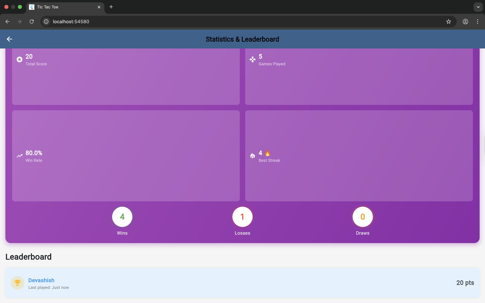

# Cyberpunk Tic Tac Toe

**Project Name:** Cyberpunk Tic Tac Toe  
**Developer:** Devashish Singh  
**Email:** [devashish4730@gmail.com]  
**Platform:** Cross-platform (Android, iOS, Web, Desktop)  
**Built with:** Flutter & Dart  

## 🎮 About The Game

Cyberpunk Tic Tac Toe reimagines the classic game with a futuristic twist. Battle against an AI that evolves across 5 difficulty levels, each with unique cyberpunk themes and increasing challenges. Features real-time game analysis, performance tracking, and stunning neon visuals.

### ✨ Key Features

- **🌆 5 Cyberpunk Levels** - From Neon Rookie to Cyber Legend
- **🤖 Progressive AI** - Adaptive difficulty that learns and improves
- **🧠 Game Analysis** - Post-game move-by-move analysis with performance scoring
- **⏱️ Time Pressure** - Configurable move timers for added challenge
- **🔥 Win Streaks** - Track consecutive victories
- **📊 Statistics** - Comprehensive player stats and leaderboard
- **💾 Multi-Profile** - Support for multiple players with saved progress
- **🎨 Dynamic Themes** - Visual themes that evolve with your level

## 📸 Screenshots

### Home Screen

*Enter the cyberpunk world with your codename*

### Game Levels

*Level 1: Neon Rookie - Blue neon theme*


*Level 3: Matrix Master - Red matrix theme*

### Game Analysis

*Detailed post-game analysis with move quality ratings*

### Statistics 

*Track your progress*

### History & Leaderboard

*Track your History gmes and compete on the leaderboard*

## 🚀 How to Play

### Installation

#### Option 1: Play on Web (Easiest)
1. Visit [http://localhost:63540/] in your browser
2. No installation required!

#### Option 2: Download APK (Android)
1. Download the latest APK from [Releases](https://github.com/YourUsername/tic-tac-toe-flutter/releases)
2. Enable "Install from Unknown Sources" in your Android settings
3. Install the APK
4. Launch "Cyberpunk Tic Tac Toe"

#### Option 3: Build from Source
```bash
# Clone the repository
git clone https://github.com/MalwareHuntercode/tic-tac-toe-flutter 
cd tic-tac-toe-flutter

# Install dependencies
flutter pub get

# Run the app
flutter run
```

### Game Rules

1. **Objective**: Get three X's in a row (horizontal, vertical, or diagonal)
2. **You play as X**, the AI plays as O
3. **You always go first**
4. **Win** = +10 points, **Loss** = -10 points, **Draw** = 0 points

### Game Controls

- **Tap** empty cells to make your move
- **Timer** (optional) - Make moves before time runs out
- **Hint Button** 💡 - Get suggestions (disabled at higher levels)
- **Reset Button** 🔄 - Restart current game
- **Analyze Game** - Review your performance after each game

### Level Progression

| Level | Name | Required Score | AI Strength | Time Limit | Features |
|-------|------|----------------|-------------|------------|----------|
| 1 | Neon Rookie | 0 | 20% | 45s | Hints available, AI makes mistakes |
| 2 | Digital Warrior | 50 | 40% | 30s | Hints available, smarter AI |
| 3 | Matrix Master | 150 | 60% | 20s | No hints, clever AI |
| 4 | System Override | 300 | 80% | 15s | No hints, very smart AI |
| 5 | Cyber Legend | 500 | 95% | 10s | No hints, near-perfect AI |

### Tips & Strategies

1. **Start with the center** - The strongest opening move
2. **Control the corners** - Second-best positions
3. **Block winning moves** - Always check if opponent can win
4. **Study the analysis** - Learn from your mistakes
5. **Build win streaks** - Consecutive wins show mastery

## 🐛 Known Issues

1. **Web Version**: Game history might clear if browser data is cleared
2. **Analysis Screen**: On very small screens, some UI elements might require scrolling
3. **Timer**: Rapid clicking during opponent's turn might cause timer sync issues

## 🔧 Troubleshooting

### App Won't Start
- Ensure you have sufficient storage space
- Try clearing app data and restarting
- Check if your device meets minimum requirements

### Score Not Saving
- Make sure you're connected to the internet (for web version)
- Don't clear browser data (web version)
- Check app permissions (mobile version)

### Performance Issues
- Close other apps to free up memory
- Disable animations in settings (if available)
- Try reducing screen brightness

## 📱 System Requirements

### Mobile
- Android 5.0+ or iOS 11.0+
- 100MB free storage
- 2GB RAM recommended

### Web
- Chrome 80+, Firefox 75+, Safari 13+, Edge 80+
- JavaScript enabled

### Desktop
- Windows 10+, macOS 10.14+, Ubuntu 18.04+
- 200MB free storage

## 🎯 Game Modes

Currently supports **Single Player** mode against AI. Future updates may include:
- Online multiplayer
- Tournament mode
- Custom difficulty settings
- Challenge missions

## 🙏 Credits

- Built with [Flutter](https://flutter.dev)
- Icons from Material Design
- Inspired by cyberpunk aesthetics and classic Tic Tac Toe

## 📄 License

This project is submitted as part of academic requirements for Junior Research Fellow (JRF) application.

---

**Enjoy the game!** 🎮 May the best player win! 🏆

